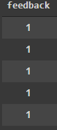

# AMAZON ALEXA REVIEWS

### GOAL : This model predicts the feedback of amazon alexa users based on the features such as ratings, variations and verified reviews.

### DATASET : [Dataset used](https://www.kaggle.com/sid321axn/amazon-alexa-reviews)

### WHAT I DID :

1. Imported numpy, pandas and sklearn for basis analysis of the data.
2. Checked for any null values. No null values were found.
3. Visualized the 'feedback' column by plotting the data as a countplot. Feedback 1 is much frequent than feedback 0 according to the plot.
4. A piechart illustrating the division of star ratings.(1 to 5)
5. Imported and used OneHotEncoder and CountVectorizer for 'verified-reviews' and 'variations' columns.
6. Splitted the data into training data and testing data.
7. Using DecisionTree Classification Algorithm, feedback has been predicted with an accuracy score of 100.
8. Using Random Forest Classification Algorithm, feedback has been predicted with an accuracy of 99.6%
9. Using Multinomail Naive Bayes, feedback has been predicted with an accuracy of 94%

### MODELS USED :

- Decision Tree for categorizing the feedbacks ie. 0 or 1 ( accuracy = 100% )
- Random Forest for better accuracy. (accuracy = 99.6% )
- Naive Bayes (MultinomialNB) (accuracy = 94%)

### LIBRARIES NEEDED :

- numpy, pandas, sklearn
- pyplot, seaborn, plotly

### SCREENSHOT :

### CONCLUSION :

This model can be used for the analysis of the product Amazon Alexa based on the valid user reviews and predict the feedback accordingly. Helpful insights such as its place in the market can be analyzed considering the feedback predicted.The task of reviewing the overall feedback of the product gets easy as the reviews are classified into two categories.

### AUTHOR :
Sonali Bedade
