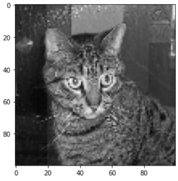

**Cats Vs Dogs Classification**

**GOAL**
The goal of this project is to classify whether the image is of a dog or a cat.

**DATASET**
Dataset can be downloaded from [kaggle](https://www.kaggle.com/chetankv/dogs-cats-images).

**WHAT I HAD DONE**
- I preprocessed images with the help of opencv module.
- Then I used Covolutional Neural Network(CNN) from keras API of tensorflow to train on the dataset.
---
Before preprocessing the images look like this

 

and after that they look like this 



**MODELS USED**
-  CNN

**LIBRARIES NEEDED**
- numpy
- os
- opencv(cv2)
- tensorflow

**CONCLUSION**
By using CNN I got 
 ```python
    loss: 0.2457
    accuracy: 0.8964
    val_loss: 0.5202
    val_accuracy: 0.7887
 ``` 