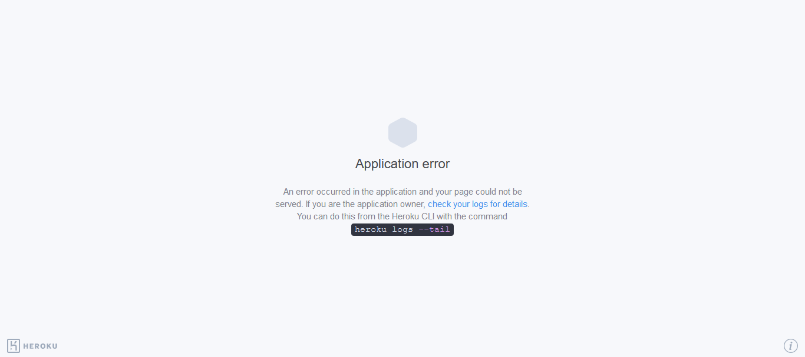
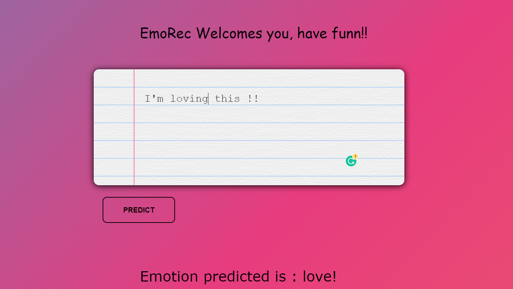

# EmoRec - An Intelligent Emotion Predictor

  

• This repository consists of files required to deploy a ___Machine Learning Web App___ created with ___Flask___ on ___Heroku___ platform.


## Why This Project :

This Project uses a natural language processing technique used to determine whether data is positive, negative or neutral. Sentiment analysis is often performed on textual data to help businesses monitor brand and product sentiment in customer feedback, and understand customer needs.


## To Run :

Visit : https://emorecognition.herokuapp.com/


## For devolepment :

* Fork the project
* Simply run ```python app.py```
* Open the Local Host using a browser


## Techstack: 
             * HTML
             * CSS
             * Python(Flask as Backend)
             


• A glimpse of the web app:


_**----- Important Note -----**_<br />
• If you encounter this webapp as shown in the picture given below, it is occuring just because **free dynos for this particular month provided by Heroku have been completely used.** _You can access the webpage on 1st of the next month._<br />
• Sorry for the inconvenience.



Screen Shot of the WebApp :

