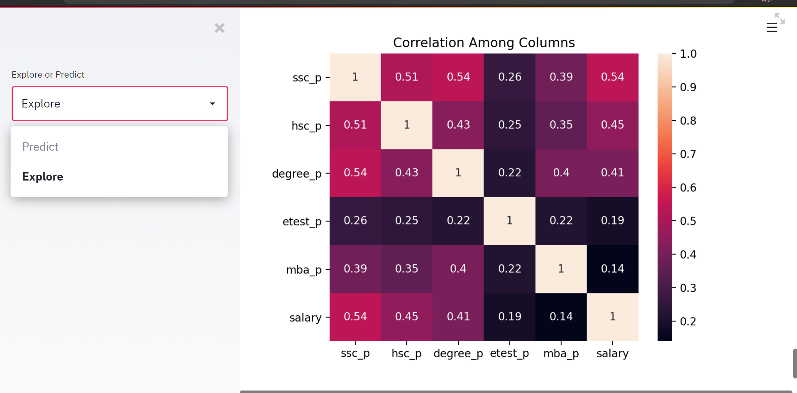
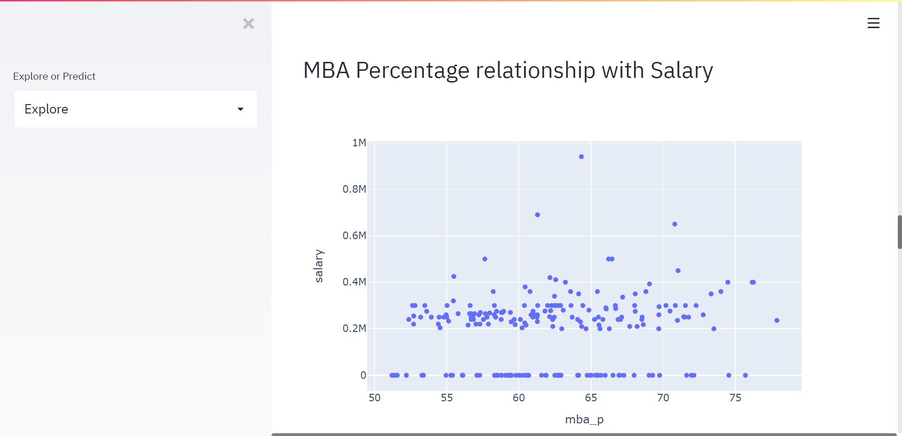
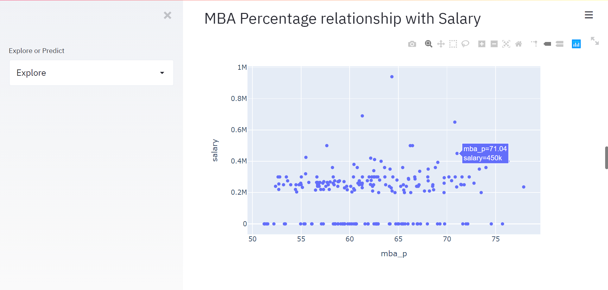
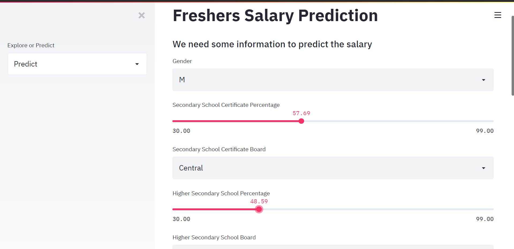

***PROJECT NAME***
Fresher's Salary Prediction Web App 

**GOAL**
The Main Goal of this project to predict the salary of fresher students on the basis of subjects, degree_type, percentages etc.

**DATASET**
https://www.kaggle.com/benroshan/factors-affecting-campus-placement

**WHAT I HAD DONE**

1. Data cleaning ,encoding  of categorical data , remove duplicate rows.
2. Perform data visulization to see the distribution of numerical data , frequency of categorical data with respect to target columns and to show the correlation among given information, feature selection.
3. Split the dataset into train and test, perform model building techniques , do cross validation to check the scores of all machine learning model and performed hyperparameter tuning.
4. Deploy the model using streamlit to predict the salary and to explore the data.

**MODELS USED**
1. LogisticRegression
2. DecisionTreeRegression
3. XGBRegression
4. Ridge Regression
5. Lasso Regression
6. RandomForest Regression
7. Elasticnet Regression

These models works very well with respect to regression problems.

**LIBRARIES NEEDED**
1. pandas 1.2.1
2. numpy 1.20.0
3. seaborn 0.11.0
4. matplotlib 3.2.1
5. sklearn 0.24.1
6. streamlit 0.61.0
7. plotly 4.4.1

INCLUSION OF **SCREENSHOT** IS MUST FOR FRONT END DESIGNERS AND UI/UX DESIGNERS.

**CONCLUSION**
Accuracy of Machine learning Models **before** applying hyperparameter optimization.

1. LinearRegression is 0.8122363395459828
2. RandomForestRegressor is 0.808660412307163
3. XgboostRegressor is 0.7816341600215869
4. RidgeRegression is 0.8128762781420746
5. LassoRegression is 0.8122453211013759
6. ElsticNetRegression is 0.5470332091450968

Accuracy of Xgboost Machine learning Models **after** performing hyperparameter optimization is
 0.890907439182005 which is higher than other models.
