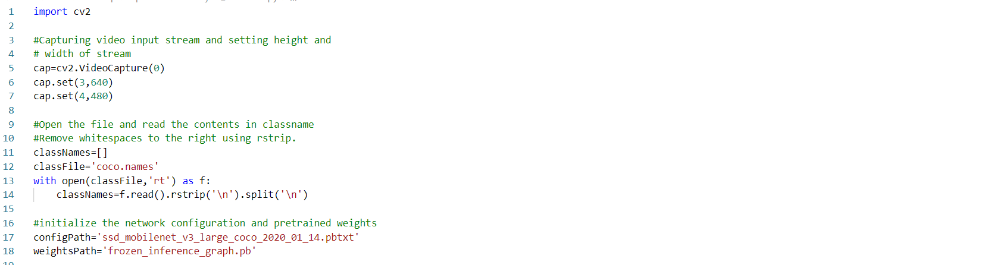
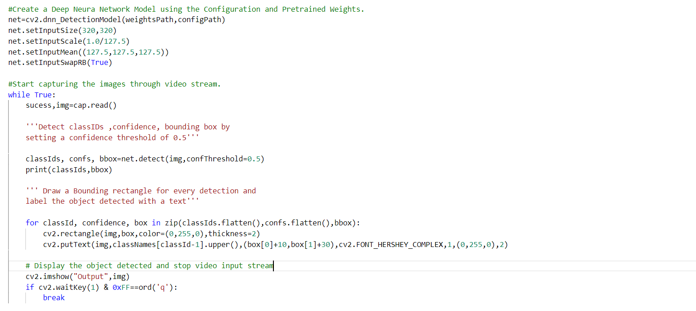

## OBJECT DETECTION USING OPENCV
</img>

### GOAL
*  To understand Computer Vision Libraries like OpenCV .
*  To detect various objects using Deep Learning Models with pretrained weights.

### DATASET
Link to the [Dataset](https://cocodataset.org/#overview)

### DESCRIPTION
* This Project aims to develop model for detecting objects using OpenCV. 
* OpenCV is a library of programming functions mainly aimed at real-time computer vision. 
* Using Deep Neural Network Detcetion Model with pretrained weights we will detect objects like book etc and draw bounding box around them for detection.
* We will be using pretrained weights of the [ssd_mobilenet_v2_coco](https://docs.openvinotoolkit.org/2021.3/omz_models_model_ssd_mobilenet_v2_coco.html) or the Single Shot Multiobject Detection Network for building our DNN model.
* DetectionModel allows to set params for preprocessing input image. DetectionModel creates net from file with trained weights and config, sets preprocessing input, runs forward pass and return result detections. For DetectionModel SSD, Faster R-CNN, YOLO topologies are supported.
  
 
### WHAT I HAVE DONE
  * Capture the Video Input Stream and set the width and height of the stream.
  * Open the coco_names file in reading mode and copy the contents to a list by removing any right whitspaces .
  * Initialize the configuration and weights to configPath and weightsPath.
  
  </img>
  
  * Create a Deep Neura Network Model using the Configuration and Pretrained Weights.
  * Start capturing the images through video stream.
  * Detect classIDs ,confidence, bounding box by setting a confidence threshold of 0.5.
  * Draw a Bounding rectangle for every detection and label the object detected with a text.
  * Display the object detected and stop video input stream by setting 'q' as the quitting key.
  
  
  </img>
  
  ### MODELS USED
  * DNN Detection Model
  * SSD Mobile-Net network.
  
  ### LIBRARIES NEEDED
  * OpenCV
  
  ### CONCLUSION
  * Understood object detection using OpenCV.
  * We can use OpenCV for tasks like object detection,face recognition,Image segmentation etc.
  * We can use pretrained weights of classic networks for our own customized tasks.
  
  ### REFERENCES
  * https://docs.opencv.org/4.5.0/d3/df1/classcv_1_1dnn_1_1DetectionModel.html
  * https://cocodataset.org/#home
  * https://docs.openvinotoolkit.org/2021.3/omz_models_model_ssd_mobilenet_v2_coco.html
  
  ## BY
  ## VAISHNAVI PATIL
