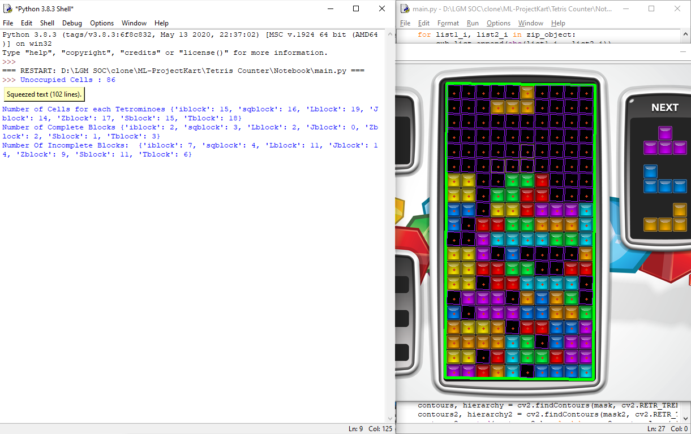

## Related Issue 

- This submission is for issue no 50 i.e. Creatating Tetris block counter

- [x] LGM-SOC'21 Participant 
- [ ] Contributor

Closes: #50

### Changes made

In this project I have made a program that would detect the tetris tetriminos and will return the count.
There are 2 possible cases:
1. The tetriminos are complete i.e. they aren't broken during gameplay
2. Incomplete tetriminos which are reduced during game play
In the program we are successfully able to detect both the types of blocks in form of dictonary.

The program returns following:
1. No of Unoccupied Cells
2. A matrix representing the block it holds in form of pandas dataframe
3. No of cells each tetriminos occupy.
4. No of complete blocks.
5. No of incomplete blocks.

## Type of change

What sort of change have you made:
<!--
Example how to mark a checkbox:-
- [x] My code follows the code style of this project.
-->
- [ ] Bug fix (non-breaking change which fixes an issue)
- [x] New feature (non-breaking change which adds functionality)
- [ ] Code style update (formatting, local variables)
- [ ] Breaking change (fix or feature that would cause existing functionality to not work as expected)
- [ ] This change requires a documentation update

## How Has This Been Tested?

I have manually counted the tetriminos and matched them with the output given by the program.
Till now its found to be correct and issues were debugged

## Checklist:
<!--
Example how to mark a checkbox:-
- [x] My code follows the code style of this project.
-->
- [x] My code follows the guidelines of this project.
- [x] I have performed a self-review of my own code.
- [ ] I have commented my code, particularly whereever it was hard to understand.
- [x] I have made corresponding changes to the documentation.
- [x] My changes generate no new warnings.
- [ ] I have added tests that prove my fix is effective or that my feature works.
- [ ] Any dependent changes have been merged and published in downstream modules.

## Screenshots

 Original           | Updated
 :--------------------: |:--------------------:
 Original Screenshot | Updated Screenshot |

